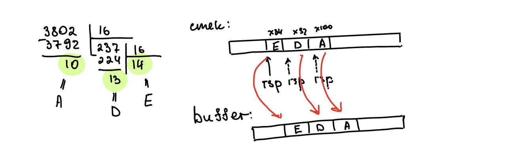

# MyPrintf

## Пользовательская часть
Чтобы скомпилировать программу:
```
make
```
Удалить все объектники
```
make clean
```
Запустить исполняемый файл
```
./app
```

## Как работает программа
Строка состоит из объектов двух различных назначений. Это символы, которые сами должны быть выведены на экран и это специфика­торы формата, определяющие вид, в котором будут выведены аргументы. Количество аргументов должно точно соответство­вать количеству спецификаторов формата, причем следовать они должны в одинаковом порядке.

Пример:
```
MyPrintf("Hello %s %d %c", "world", 100, 33);
```
Этот пример риведет к выводу «Hello world 100!».

Команды форматирования для printf():
- %d -> Десятичное число целого типа со знаком
- %x -> Шестнадцатиричное целое число без знака (буквы верхнего регистра)
- %o -> Восьмеричное целое число без знака
- %b -> Двоичное число целого типа со знаком
- %% -> Выводит символ %
- %s -> Строка символов
- %c -> Символ типа char

Если количество аргументов меньше, чем количество команд форматирования, то вывод не­определен. Если же количество аргументов больше, чем команд форматирования, то лишние ар­гументы отбрасываются.

Функция MyPrintf() возвращает количество действительно выведенных символов.

## Что-то типо теоретической части
Общий принцип того, как происходит передача аргументов:
1. Передача через регистры: обычно первые несколько аргументов передаются непосредственно через регистры процессора. Это первые 6 регистров RDI, RSI, RDX, RCX, R9, R8
2. Передача через стек: Когда количество аргументов превышает определенное количество (6), они передаются через стек.

Пример
```
MyPrintf("Hello %s %d %c %x %o %% %x", "world", 100, 33, 67, 56, 1234);
```

В таком случае аргументы распределяться следующим образом:
- RDI -> "Hello %s %d %c %x %o %% %x"
- RSI -> "world"
- RDX -> 100
- RCX -> 33
- R8  -> 67
- R9  -> 56
- в стек -> 1234

Далее первые 6 регистров кладутся в стек, так проще и понятнее дальше работать с аргументами

Получаем такой стек:


Далее мы циклом идем по форматной строке и проверяем на наличие '%'. В зависимости от следующего символа после '%' выполняются опредленные преобразования аргуента.

Например, если это %x, достается аргумент из стека, который нужно преобраовать в 16 вид. Берется остаток от деления на 16 и записывается в стек. Таким образом при последовательных push из стека будет возвращаться нужно число.

Небольшая визуализация



## JMP_TABLE
Для перехода на нужный спецификатор формата я использую таблицу переходов (Jump Table). Используется для выбора действия в зависимости от входного символа.

Oписание таблицы переходов:
1. Код начинается с метки JmpTable, которая представляет собой местоположение начала таблицы переходов.
2. align 8 обеспечивает выравнивание таблицы по границе в 8 байт для оптимизации производительности на некоторых архитектурах процессора.

Записи таблицы:
1. Каждая запись в таблице представляет собой 8-байтное значение (qword), это адрес метки, куда будет производиться переход.

Заполнение таблицы:
1. times используется для повторения блока кода. Например, times 10 dq 'd' заполняет 10 ячеек в таблице значением d.

Выбор действия на основе входного символа:
1. Далее идет код, который считывает символ в регистр al и сравнивает его с символом % (как пример условия выбора).
2. Если символ равен %, программа переходит к обработке типа символа % (TypeSymbolProcent).
3. Если символ не равен %, программа вычитает код символа 'b' из регистра rax.

Выбор адреса из таблицы:
1. Чтобы определить, куда перейти для обработки символа, вычисляем смещение в таблице, используя арифметику указателей.
2. Сначала загружается базовый адрес таблицы в регистр rdx с помощью lea.
Затем регистр rax умножается на 8, так как каждая запись в таблице имеет размер 8 байт (размер qword).

Переход к целевой метке:
1. Используя адрес из таблицы, программа делает переход к указанной метке с помощью jmp [rdx].
