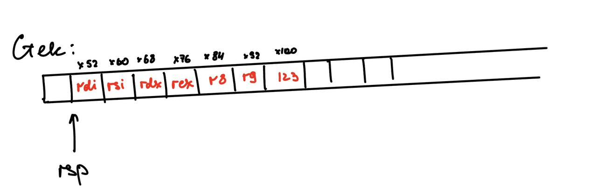
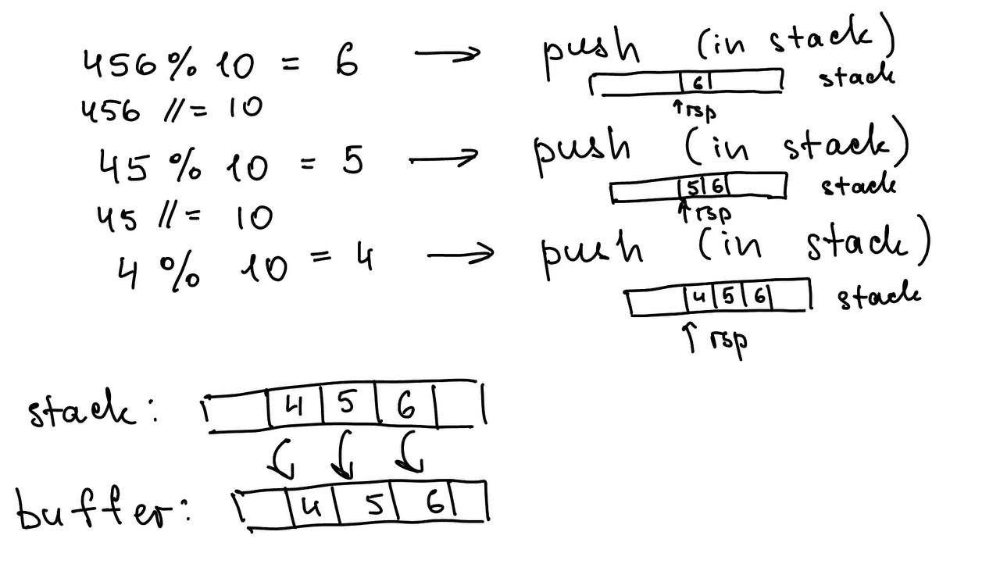

# MyPrintf

## Описание задания
Данный проект представляет собой часть учебного курса по предмету "Архитектура вычислительных систем и языки ассемблерное программирование". В рамках этого курса мы изучаем основы ассемблерного программирования и структуру вычислительных систем.

Задача заключается в том, чтобы написать свою собственную реализацию функции **printf**, используя язык ассемблера.

## Пользовательская часть
Чтобы скомпилировать программу:
```
make
```
Удалить все объектники
```
make clean
```
Запустить исполняемый файл
```
./app
```

## Как работает программа
Форматная строка функции состоит из символов двух типов. Это символы, которые сами должны быть выведены на экран и это специфика­торы формата, определяющие вид, в котором будут выведены аргументы. Количество аргументов должно точно соответствовать количеству спецификаторов формата, причем следовать они должны в одинаковом порядке.

Пример:
```
MyPrintf("Hello %s %d%c", "world", 100, 33);
```
Этот пример приведет к выводу «Hello world 100!».

Команды форматирования для printf():
- %d -> Десятичное число целого типа со знаком
- %x -> Шестнадцатеричное целое число без знака (буквы верхнего регистра)
- %o -> Восьмеричное целое число без знака
- %b -> Двоичное число целого типа со знаком
- %% -> Выводит символ %
- %s -> Строка символов
- %c -> Символ типа char

Если количество аргументов меньше, чем количество команд форматирования, то вывод не­определен. Если же количество аргументов больше, чем команд форматирования, то лишние ар­гументы отбрасываются.

Функция MyPrintf() возвращает количество действительно выведенных символов.

## Общий принцип передачи аргументов (для NASM на платформе x86_64)
Общий принцип того, как происходит передача аргументов (для NASM на платформе x86_64):
- Передача через регистры: первые аргументы передаются непосредственно через регистры процессора. Это первые 6 регистров RDI, RSI, RDX, RCX, R9, R8
- Передача через стек: Когда количество аргументов превышает 6, то они передаются через стек.

Пример
```
MyPrintf("Hello %s %d %c %x %o %% %x", "world", 100, 33, 67, 56, 1234);
```

В таком случае аргументы распределяться следующим образом:
- RDI -> offset "Hello %s %d %c %x %o %% %x"
- RSI -> offset "world"
- RDX -> 100
- RCX -> 33
- R8  -> 67
- R9  -> 56
- в стек -> 1234

Далее первые 6 регистров кладутся в стек, так проще и понятнее дальше работать с аргументами

Получаем такой стек:



Когда аргументы помещаются на стек, они располагаются в памяти в порядке, обратном их объявлению. Например, если мы передаем аргументы "1234" и "56", они будут размещены на стеке таким образом, что "56" будет находиться на вершине стека, а "1234" - ниже него.

Такой подход обеспечивает корректное извлечение аргументов из стека в обратном порядке, что позволяет правильно передавать их в функции и обрабатывать.

## Обработка форматной строки

Описание процесса:

После передачи аргументов функции MyPrintf, программа начинает обработку форматной строки, используя таблицу переходов. Этот процесс включает в себя следующее:

- программа проверяет каждый символ в форматной строке на наличие символа '%'. Если символ '%' обнаружен, программа переходит к обработке соответствующего спецификатора формата.

Например, если это %d, достается аргумент из стека, который нужно преобразовать в десятичную систему счисления. Берется остаток от деления на 10 и записывается в стек. Таким образом при последовательных push из стека будет возвращаться нужно число.

Небольшая визуализация




## JMP_TABLE
Для перехода на нужный спецификатор формата я использую таблицу переходов (Jump Table), аналогичную механизму switch в языке Си. Это позволяет выбирать действие в зависимости от входного символа, обеспечивая гибкость и эффективность в обработке форматной строки. (использую в файле myPrintf.s на строке 485)

Описание таблицы переходов:
- Код начинается с метки JmpTable, которая представляет собой местоположение начала таблицы переходов.
- align 8 обеспечивает выравнивание таблицы по границе в 8 байт для оптимизации производительности на некоторых архитектурах процессора.

Записи таблицы:
- Каждая запись в таблице представляет собой 8-байтное значение (qword), это адрес метки, куда будет производиться переход.

Заполнение таблицы:
- times используется для повторения блока кода. Например, times 10 dq 'd' заполняет 10 ячеек в таблице значением d.

Выбор действия на основе входного символа:
- Далее идет код, который считывает символ в регистр al и сравнивает его с символом % (как пример условия выбора).
- Если символ равен %, программа переходит к обработке типа символа % (TypeSymbolProcent).
- Если символ не равен %, программа вычитает код символа 'b' из регистра rax.

Выбор адреса из таблицы:
- Чтобы определить, куда перейти для обработки символа, вычисляем смещение в таблице, используя арифметику указателей.
- Сначала загружается базовый адрес таблицы в регистр rdx с помощью lea.
Затем регистр rax умножается на 8, так как каждая запись в таблице имеет размер 8 байт (размер qword).

Переход к целевой метке:
- Используя адрес из таблицы, программа делает переход к указанной метке с помощью jmp [rdx].
